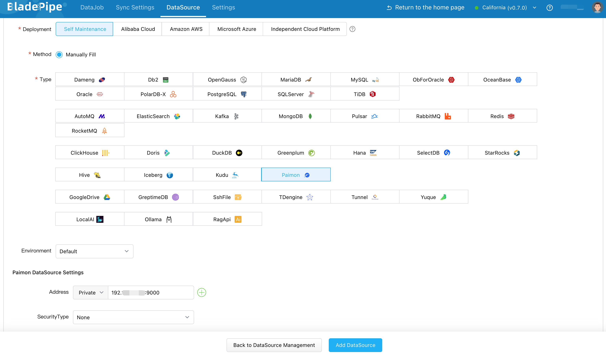
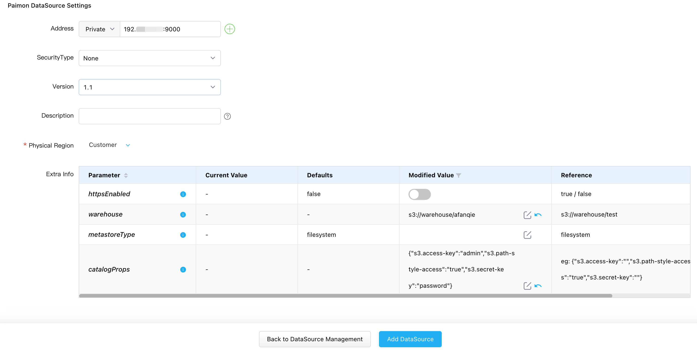
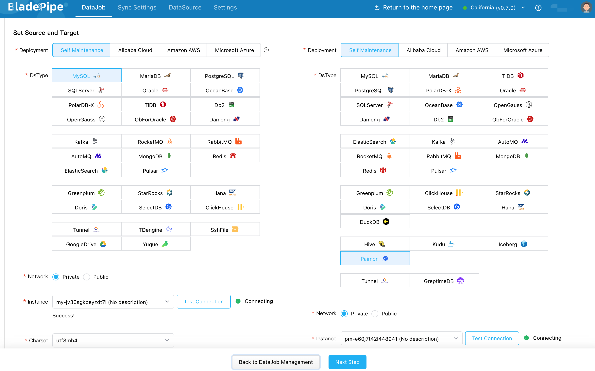
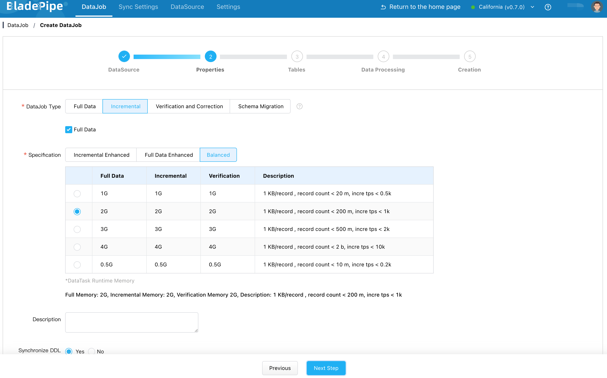
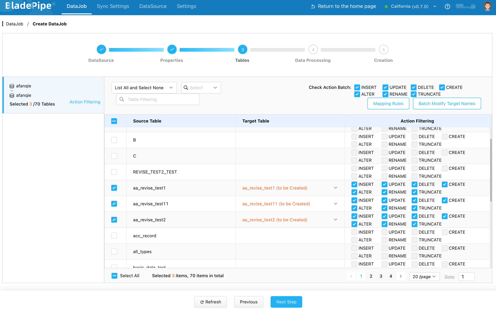
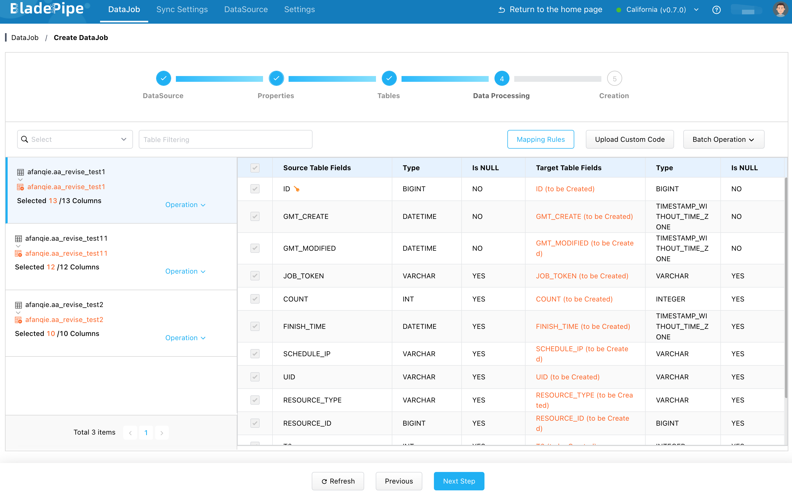
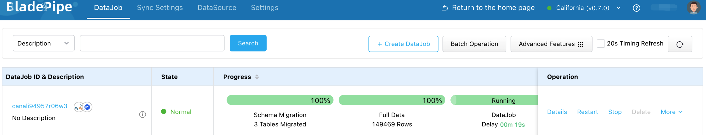

<!--
Licensed to the Apache Software Foundation (ASF) under one
or more contributor license agreements.  See the NOTICE file
distributed with this work for additional information
regarding copyright ownership.  The ASF licenses this file
to you under the Apache License, Version 2.0 (the
"License"); you may not use this file except in compliance
with the License.  You may obtain a copy of the License at

  http://www.apache.org/licenses/LICENSE-2.0

Unless required by applicable law or agreed to in writing,
software distributed under the License is distributed on an
"AS IS" BASIS, WITHOUT WARRANTIES OR CONDITIONS OF ANY
KIND, either express or implied.  See the License for the
specific language governing permissions and limitations
under the License.
-->

# BladePipe
[BladePipe](https://www.bladepipe.com) is a real-time end-to-end data integration tool, offering 40+ out-of-the-box connectors for analytics or AI. It allows to move data faster and easier than ever, with ultra-low latency less than 3 seconds. It provides a one-stop data movement solution, including schema evolution, data migration and sync, verification and correction, monitoring and alerting. All is done in an automated and visualized way.

## Supported Sources
Now BladePipe supports data integration to Paimon from the following sources:
- MySQL
- Kafka
More sources are to be supported.

In this article, we will show how to load data from MySQL to Paimon.

## Prepare BladePipe

Follow the instructions in [Install Worker (Docker)](https://doc.bladepipe.com/productOP/byoc/installation/install_worker_docker) or [Install Worker (Binary)](https://doc.bladepipe.com/productOP/byoc/installation/install_worker_binary) to download and install a BladePipe Worker.


Alternatively, you can choose to deploy and run [BladePipe Enterprise](https://doc.bladepipe.com/productOP/onPremise/installation/install_all_in_one_binary).


## Adding DataSources
1. Log in to the BladePipe Cloud.
2. Click **DataSource** > **Add DataSource**, and add MySQL and Paimon instances.

3. When adding a Paimon instance, special configuration is requried. See Add a Paimon Instance.

## Synchronizing Data
1. Go to **DataJob** > **Create DataJob**.
2. Select the source and target DataSources, and click **Test Connection** for both. 

3. Select **Incremental** for DataJob Type, together with the **Full Data** option.

4. Select the tables to be replicated.

5. Select the columns to be replicated.

6. Confirm the DataJob creation, and start to run the DataJob.
