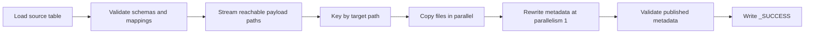

# Full-History Paimon Clone Design

## Problem

Operators need to copy a complete Paimon table between storage clusters while preserving retained
history. The existing `clone_from=paimon` implementation is a logical clone: it reads rows, creates
a target table, and writes new snapshots. It does not preserve snapshot IDs, schema history, tags,
branches, manifests, or physical file identity.

This design adds an explicit physical clone mode. It copies reachable payload files and rebuilds
the metadata graph at a mapped target location. Existing logical clone behavior remains the
default.

## Scope

The first version:

- clones one complete Paimon table;
- preserves all retained main and branch snapshots, tags, long-lived changelogs, and schemas;
- copies normal and external data files, extra files, and index files;
- rewrites table, data, and index absolute paths through explicit prefix mappings;
- uses independent source and target `FileIO` instances;
- executes file copies in Flink with user-defined parallelism independent of bucket count; and
- writes a usable table root without registering it in the target catalog.

The source table is assumed to be stopped by the operator before the action starts. The action
records a fingerprint of the source metadata roots and rejects a clone or retry if schemas,
snapshots, tags, branches, or long-lived changelogs change during the operation.

The first version does not:

- register the target table or refresh catalog caches;
- coordinate engine cutover, scheduling, billing, or rollback;
- support filtered, format-converting, or metadata-only physical clone;
- migrate Iceberg compatibility metadata;
- rewrite blob descriptors embedded in data-file rows;
- follow `blob-view-field` references into other tables;
- provide Spark execution or storage-specific server-side copy; or
- provide atomic rollback or automatic cleanup of completed payload files and generated metadata.

## Interface

### Flink Action

```bash
clone \
  --clone_from paimon \
  --clone_mode full-history \
  --database default \
  --table source_table \
  --catalog_conf metastore=hive \
  --catalog_conf uri=thrift://localhost:9088 \
  --target_database target_db \
  --target_table target_table \
  --target_catalog_conf warehouse=dfs://target-cluster/warehouse \
  --path_mapping dfs://source-cluster/warehouse=dfs://target-cluster/warehouse \
  --path_mapping dfs://source-cluster/external-data=dfs://target-cluster/external-data \
  --path_mapping dfs://source-cluster/external-index=dfs://target-cluster/external-index \
  --parallelism 100
```

`clone_mode` defaults to `logical`. `full-history` requires `clone_from=paimon`.

The target table root is the mapped source table root. For example, if the source table is
`dfs://source-cluster/warehouse/default.db/source_table`, the warehouse mapping above produces
`dfs://target-cluster/warehouse/default.db/source_table`. `target_database` and `target_table` are
optional logical identifiers. When supplied, they become part of the clone marker identity, but S1
does not use them to derive the target path or register a catalog table.

`target_catalog_conf` supplies credentials and filesystem configuration for a resolving target
`FileIO`. It is not restricted to Hive catalog configuration.

S1 uses this configuration only to resolve target filesystems. It does not create a target catalog
or support credentials that can only be obtained after registering a specific target table. Such
catalog-managed credentials require the later registration phase.

### Flink Procedure

```sql
CALL sys.clone(
  database => 'default',
  table => 'source_table',
  catalog_conf => 'metastore=hive,uri=thrift://localhost:9088',
  target_database => 'target_db',
  target_table => 'target_table',
  target_catalog_conf => 'warehouse=dfs://target-cluster/warehouse',
  parallelism => 100,
  clone_from => 'paimon',
  clone_mode => 'full-history',
  path_mapping => 'dfs://source-cluster/warehouse=dfs://target-cluster/warehouse'
);
```

The new procedure arguments are appended after the existing arguments to preserve positional-call
compatibility.

### Full-History Option Rules

- `database` and `table` must identify one source table. `target_database` and `target_table` are
  optional logical target identifiers.
- `path_mapping` is required and may be repeated by the action. The procedure accepts a
  comma-separated list.
- `where`, `included_tables`, `excluded_tables`, `prefer_file_format`, and `meta_only` are rejected.
- `parallelism` controls physical file-copy concurrency.
- `clone_if_exists` defaults to `false` for full-history mode and keeps its previous default for
  logical clone. Set it to `true` only to resume an incomplete clone with the same marker identity.

## Reachability

The clone follows metadata references instead of listing storage directories. This uses the same
root-set idea as `OrphanFilesClean`, with clone-specific readers and writers.

For the main branch and every named branch, it visits:

- every retained snapshot;
- every tagged snapshot;
- every long-lived changelog and the manifest graph it still owns;
- every schema file;
- base, delta, and changelog manifest lists reachable under Paimon's retention rules;
- manifests referenced by those lists;
- statistics files;
- index manifests and their index files; and
- data and extra files referenced by manifest entries.

This includes Paimon-managed blob data represented as ordinary data files. It does not include
unreachable files or arbitrary files placed in data directories.

For a retained snapshot or tag, base and delta manifests are merged with the same ADD/DELETE
semantics as a normal table scan. Changelog payload is collected from its dedicated changelog
manifest when present; otherwise APPEND-origin files in the delta manifest are retained for
incremental reads. A long-lived changelog with a dedicated changelog manifest owns only that
manifest graph. Without one, it owns the base and delta manifest graphs. Index and statistics
metadata remain snapshot-owned, matching `ChangelogDeletion`.

Payload discovery runs as a bounded Flink operator and emits one copy record at a time. It does not
materialize the complete path set in the client or embed millions of paths in the JobGraph.
References may emit the same physical path more than once. Copy records are keyed by normalized
target path, so duplicates are serialized and reuse the same existing-file size check without
retaining the full path set in the planner, client, or Flink state.

## Path Mapping

Each mapping has the form:

```text
source-prefix=target-prefix
```

Rules:

- paths are normalized with Paimon's `Path` implementation;
- matching is path-boundary aware, not substring replacement;
- the longest matching source prefix wins;
- every table or payload path must match a mapping;
- duplicate source prefixes are rejected;
- source and target mapping spaces must not overlap;
- target prefixes must be pairwise non-overlapping, which makes the prefix mapping injective
  without retaining one collision-detection state entry per copied file;
- source and target table roots must not overlap; and
- copy records are keyed by target path so repeated references are processed serially.
- repeated references reuse the normal existing-target size validation.

Mappings apply to:

- the table root and the schema `path` option;
- each configured data external root;
- `DataFileMeta.externalPath` in manifests;
- the global index external root; and
- `IndexFileMeta.externalPath` in index manifests.

Extra files follow their data file's resolved parent. Index metadata such as row ranges and opaque
index-specific bytes is preserved; only the declared external file path is rewritten.

## Execution



### Copy

The source table supplies the source `FileIO`. A resolving target `FileIO`, configured from
`target_catalog_conf`, can write mapped paths across multiple schemes or authorities.

Each non-overwrite copy uses a 1 MiB buffered stream and two-phase publication:

```text
sourceFileIO.newInputStream(source)
  -> targetFileIO.newTwoPhaseOutputStream(target, false)
  -> closeForCommit()
  -> commit()
```

Before copying, the task records and rechecks source size. It verifies the copied byte count before
commit and target size after commit. A failed transfer discards its temporary output instead of
publishing a partial payload file. An existing same-size target is skipped; an existing
different-size target fails. Same-size skipping handles both repeated metadata references in one
run and retries without retaining one state entry per file.

The mapped external-data and external-index target locations must be dedicated to this clone and
must not be modified while it runs. S1 intentionally does not overwrite an unknown conflicting
file, but size equality alone cannot prove that existing file contents are identical.

The copy operator parallelism is exactly the requested action parallelism. It is not keyed by
bucket, partition, snapshot, branch, or tag. Therefore effective concurrency is bounded by the
number of physical file records, not by table bucket count. The copy stage does not retain one state
entry per file. S1 does not split a single large file.

### Metadata Publication

Metadata rewrite starts only after all copy subtasks finish. It uses Paimon serializers and writers,
not text replacement.

The rewriter:

- restores all historical schemas with their original IDs and rewritten path options without
  applying current schema-creation validation;
- rewrites data manifests and index manifests;
- writes new manifest lists referencing rewritten manifests;
- copies statistics files;
- writes snapshots with original IDs, schema IDs, commit metadata, counts, watermarks, row IDs,
  and operations but new metadata file references;
- recreates tags with original explicit creation time, or materializes the source tag file time
  for legacy tags, and preserves retention;
- recreates long-lived changelogs using their dedicated-manifest or base/delta retention form;
- recreates branch-local metadata; and
- commits earliest and latest hints.

Generated metadata file names may differ from the source. Logical history and physical payload
file names are preserved.

## Validation

Every copy task validates source size and target existence/size before it emits completion. Once
all payload tasks finish, the finalizer opens the target table root and validates:

- the same named branches exist;
- every branch has the same schema, snapshot, tag, and changelog IDs; and
- tag creation and retention identities are preserved.

Core end-to-end tests additionally collect both full reachable sets, compare mapped data and index
paths, verify every metadata and payload file exists, and produce scan plans for every retained
snapshot and tag. The distributed production path avoids rebuilding or scanning a PB-scale payload
set in one finalizer.

Size validation is not a checksum. The table-root marker rejects an unknown non-empty table root,
while mapped locations outside that root rely on the exclusive-target contract. Checksums or
storage-native verification can provide a stronger content guarantee later.

## Failure and Retry

The operation is not atomic. Two-phase payload output prevents a failed transfer from publishing a
partial payload file, but a failure can leave complete payload files, temporary objects, or
partially generated metadata at the target. The target is usable only after the action reports
success, and S1 does not register it automatically.

The initial run requires an absent or empty target root and writes a `_full_history_clone` marker
containing the normalized source root, target root, optional logical target identifier, mappings,
and source fingerprint. The fingerprint is checked before and after payload discovery and metadata
publication. This turns the operational stop-write requirement into an optimistic consistency
guard without scanning PB-scale file contents.

After validation succeeds, the finalizer writes `_SUCCESS` with the same clone identity. A target
root without `_SUCCESS` is incomplete and must not be published. With `clone_if_exists=true`, a
retry requires an exact ownership marker match and no `_SUCCESS`; an arbitrary non-empty root and a
completed clone are both rejected. After ownership validation, a retry:

- skips existing files whose sizes match;
- fails on different-size files;
- may leave unreferenced metadata generated by an earlier failed finalization; and
- deterministically republishes snapshot, tag, changelog, and hint entry files.

The marker distinguishes an initial run from a retry at the table level. Per-file copies use the
same idempotent size rule in both cases because one physical file may be referenced by many
snapshots, tags, or branches. Stronger detection of pre-existing same-size files outside the table
root would require checksums or durable per-file ownership state.

Automatic cleanup and full-table staging are intentionally omitted. Rename is cheap on some
distributed filesystems but can become copy-plus-delete on object stores, which is unsuitable as a
portable PB-scale commit protocol.

## Blob Boundary

Paimon-managed blob files that appear as ordinary manifest data files are supported.

`blob-descriptor-field` is rejected because its URI is serialized inside data-file rows. Correct
migration requires decoding and rewriting those rows, potentially changing the physical data file.
`blob-view-field` is also rejected because it references another table and requires a multi-table
closure. All schemas in every branch are checked before copy begins.

## Tests

Coverage includes:

- URI normalization, boundary-aware longest-prefix mapping, overlap rejection, and conflicts;
- same-size retry, different-size failure, source-size change detection, and no visible partial
  payload after a failed copy;
- retained snapshots, schema evolution, tags, branches, and historical scans;
- restoration of historical branch schemas whose options depend on an already-created branch;
- external data paths and external global index paths;
- preservation of global index metadata bytes;
- blob descriptor rejection;
- streaming visitor parity with the full reachable-file collector;
- long-lived changelogs with both dedicated changelog manifests and base/delta fallback;
- action option validation, optional logical target identity, and logical-mode compatibility; and
- marker creation, resume identity, corrupt completion, publication ownership, and legacy
  procedure-call compatibility; and
- a Flink mini-cluster clone with source `bucket=1`, copy parallelism `4`, external data, tags,
  branches, an empty table, completion marker, completed-job rejection, and explicit recovery from
  a missing completion marker.

## Follow-Ups

- Rewrite data files containing blob descriptors.
- Resolve and clone multi-table blob views.
- Add Spark procedure execution over the reusable core implementation.
- Add storage-native server-side copy and multipart/range copy.
- Add target catalog registration after a successful clone.
- Add checksums, progress metrics, and a durable clone report.
- Add incremental catch-up while the source is still receiving writes.
- Make payload discovery checkpointable and parallel for tables with extreme metadata history.
- Parallelize metadata rewrite or partition its manifest-name mapping when serial finalization
  becomes a measurable bottleneck.
