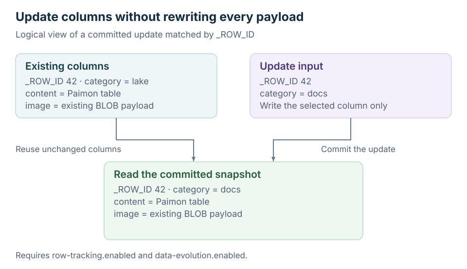

<!--
Licensed to the Apache Software Foundation (ASF) under one
or more contributor license agreements.  See the NOTICE file
distributed with this work for additional information
regarding copyright ownership.  The ASF licenses this file
to you under the Apache License, Version 2.0 (the
"License"); you may not use this file except in compliance
with the License.  You may obtain a copy of the License at

  http://www.apache.org/licenses/LICENSE-2.0

Unless required by applicable law or agreed to in writing,
software distributed under the License is distributed on an
"AS IS" BASIS, WITHOUT WARRANTIES OR CONDITIONS OF ANY
KIND, either express or implied.  See the License for the
specific language governing permissions and limitations
under the License.
-->

# Data Evolution

Data evolution lets you update selected columns while preserving the remaining
columns and media payloads. This page covers the lower-level Python update and
commit APIs; use [Multimodal Tables](./multimodal-tables#update) for the compact
interface. See [Data Evolution](../multimodal-table/data-evolution) for the storage
model.

| You have… | Use |
| --- | --- |
| Row IDs and replacement values | [Update by row ID](#update-columns-by-row-id) |
| A filter and assignments | [Update by predicate](#update-columns-by-predicate) |
| Rows to remove | [Delete rows](#delete-rows) |
| Business keys with new values | [Upsert by key](#upsert-by-key) |
| Conditional update, delete, and insert rules | [Merge into](#merge-into) |
| A derived column to compute in batches | [Update by shards](#update-columns-by-shards) |

For distributed updates, see [Ray Data](./ray-data).

Each complete example creates a table in `/tmp/warehouse`; use a fresh warehouse
or choose new table names when rerunning it. Shorter follow-up blocks reuse the
objects from the preceding example. Schema and data types must match when using
the lower-level Arrow write API.



## Prerequisites

To use partial updates / data evolution, enable both options when creating the table:

- **`row-tracking.enabled`**: `true`
- **`data-evolution.enabled`**: `true`

## Update Columns By Row ID

You can use `update_by_arrow_with_row_id` to update columns in data evolution tables.

The input data should include the `_ROW_ID` column. The update operation will automatically sort and match each `_ROW_ID`
to its corresponding `first_row_id`, then group rows with the same `first_row_id` and write them to a separate file.

**Requirements for `_ROW_ID` updates**

- **Update columns only**: include `_ROW_ID` plus the columns you want to update (partial schema is OK).

```python
import pyarrow as pa
from pypaimon import CatalogFactory, Schema

catalog = CatalogFactory.create({'warehouse': '/tmp/warehouse'})
catalog.create_database('default', False)

simple_pa_schema = pa.schema([
  ('f0', pa.int8()),
  ('f1', pa.int16()),
])
schema = Schema.from_pyarrow_schema(simple_pa_schema,
                                    options={'row-tracking.enabled': 'true', 'data-evolution.enabled': 'true'})
catalog.create_table('default.test_row_tracking', schema, False)
table = catalog.get_table('default.test_row_tracking')

# write all columns
write_builder = table.new_batch_write_builder()
table_write = write_builder.new_write()
table_commit = write_builder.new_commit()
expect_data = pa.Table.from_pydict({
  'f0': [-1, 2],
  'f1': [-1001, 1002]
}, schema=simple_pa_schema)
table_write.write_arrow(expect_data)
table_commit.commit(table_write.prepare_commit())
table_write.close()
table_commit.close()

# update partial columns
write_builder = table.new_batch_write_builder()
table_update = write_builder.new_update().with_update_type(['f0'])
table_commit = write_builder.new_commit()
data2 = pa.Table.from_pydict({
  '_ROW_ID': [0, 1],
  'f0': [5, 6],
}, schema=pa.schema([
  ('_ROW_ID', pa.int64()),
  ('f0', pa.int8()),
]))
cmts = table_update.update_by_arrow_with_row_id(data2)
table_commit.commit(cmts)
table_commit.close()

# content should be:
#   'f0': [5, 6],
#   'f1': [-1001, 1002]
```

## Update Columns By Predicate

You can use `update_by_predicate` for SQL-like `UPDATE ... SET ... WHERE ...`
operations. Assignments may be literals or callables. Callables require explicit
`read_columns` and may run in multiple bounded batches. They must be deterministic,
side-effect-free, and row-local, and return one Arrow value per input row. Inputs
are read from the same pinned snapshot used to plan the update.
When global indexes are available, `update_by_predicate` discovers matching
`_ROW_ID` values with `scalar-index.search-mode=full` on the configured
point-in-time scan snapshot or, if none is configured, the latest snapshot.

```python
import pyarrow as pa
from pypaimon import CatalogFactory, Schema

catalog = CatalogFactory.create({'warehouse': '/tmp/warehouse'})
catalog.create_database('default', False)

pa_schema = pa.schema([
    ('id', pa.int32()),
    ('name', pa.string()),
    ('age', pa.int32()),
])
schema = Schema.from_pyarrow_schema(
    pa_schema,
    options={'row-tracking.enabled': 'true', 'data-evolution.enabled': 'true'},
)
catalog.create_table('default.users_update', schema, False)
table = catalog.get_table('default.users_update')

# write initial data
write_builder = table.new_batch_write_builder()
write = write_builder.new_write()
commit = write_builder.new_commit()
write.write_arrow(pa.Table.from_pydict(
    {'id': [1, 2, 3], 'name': ['Alice', 'Bob', 'Charlie'], 'age': [30, 25, 28]},
    schema=pa_schema,
))
commit.commit(write.prepare_commit())
write.close()
commit.close()

# UPDATE users_update SET age = age + 1 WHERE id IN (1, 3)
write_builder = table.new_batch_write_builder()
table_update = write_builder.new_update()
predicate = table_update.new_predicate_builder().is_in('id', [1, 3])
messages = table_update.update_by_predicate(
    predicate,
    {'age': lambda rows: pa.compute.add(rows['age'], 1)},
    read_columns=['age'],
)

commit = write_builder.new_commit()
commit.commit(messages)
commit.close()
```

## Delete Rows

Use `delete_by_predicate` for SQL-like `DELETE ... WHERE ...` operations.
For row-level deletes, the target table must enable deletion vectors in
addition to the [Prerequisites](#prerequisites):

- **`deletion-vectors.enabled`**: `true`

Deletes are written as deletion-vector index updates. If the predicate only
references partition columns, PyPaimon uses a partition overwrite/drop path
instead of scanning `_ROW_ID` values; that partition-only fast path does not
require deletion vectors.

```python
import pyarrow as pa
from pypaimon import CatalogFactory, Schema

catalog = CatalogFactory.create({'warehouse': '/tmp/warehouse'})
catalog.create_database('default', True)
pa_schema = pa.schema([
    ('id', pa.int32()),
    ('name', pa.string()),
    ('age', pa.int32()),
])
schema = Schema.from_pyarrow_schema(
    pa_schema,
    options={
        'row-tracking.enabled': 'true',
        'data-evolution.enabled': 'true',
        'deletion-vectors.enabled': 'true',
    },
)
catalog.create_table('default.users_delete', schema, False)
table = catalog.get_table('default.users_delete')

# Write three rows; their row IDs in this fresh table are 0, 1, and 2.
write_builder = table.new_batch_write_builder()
writer = write_builder.new_write()
commit = write_builder.new_commit()
try:
    writer.write_arrow(pa.Table.from_pydict(
        {'id': [1, 2, 3], 'name': ['Alice', 'Bob', 'Charlie'], 'age': [25, 30, 40]},
        schema=pa_schema,
    ))
    commit.commit(writer.prepare_commit())
finally:
    writer.close()
    commit.close()

write_builder = table.new_batch_write_builder()
table_update = write_builder.new_update()
table_commit = write_builder.new_commit()

# DELETE FROM users_delete WHERE age >= 35
predicate = table_update.new_predicate_builder().greater_or_equal('age', 35)
messages = table_update.delete_by_predicate(predicate)
table_commit.commit(messages)
table_commit.close()
```

If you already have `_ROW_ID` values, use `delete_by_row_id` to write deletion
vectors directly. This follow-up deletes the first row from the fresh table
above; use row IDs obtained from your target table in an existing dataset.

```python
write_builder = table.new_batch_write_builder()
table_update = write_builder.new_update()
table_commit = write_builder.new_commit()
messages = table_update.delete_by_row_id([0])
try:
    table_commit.commit(messages)
finally:
    table_commit.close()
```

## Filter by _ROW_ID

Requires the same [Prerequisites](#prerequisites) (row-tracking and data-evolution enabled). On such tables you can filter by `_ROW_ID` to prune files at scan time. Supported: `equal('_ROW_ID', id)`, `is_in('_ROW_ID', [id1, ...])`, `between('_ROW_ID', low, high)`.

```python
pb = table.new_read_builder().new_predicate_builder()
rb = table.new_read_builder().with_filter(pb.equal('_ROW_ID', 0))
result = rb.new_read().to_arrow(rb.new_scan().plan().splits())
```

## Upsert By Key

See [upsert by key](./merge-into#upsert-by-key) for the full example, key matching rules, and commit lifecycle.

## Merge Into

See [merge into](./merge-into#merge-into) for the full example, key matching rules, and commit lifecycle.

## Update Columns By Shards

If you want to **compute a derived column** (or **update an existing column based on other columns**) without providing
`_ROW_ID`, you can use the shard scan + rewrite workflow:

- Read only the columns you need (projection)
- Compute the new values in the same row order
- Write only the updated columns back
- Commit per shard

This is useful for backfilling a newly added column, or recomputing a column from other columns.

**Example: compute `d = c + b - a`**

```python
import pyarrow as pa
from pypaimon import CatalogFactory, Schema

catalog = CatalogFactory.create({'warehouse': '/tmp/warehouse'})
catalog.create_database('default', False)

table_schema = pa.schema([
    ('a', pa.int32()),
    ('b', pa.int32()),
    ('c', pa.int32()),
    ('d', pa.int32()),
])

schema = Schema.from_pyarrow_schema(
    table_schema,
    options={'row-tracking.enabled': 'true', 'data-evolution.enabled': 'true'},
)
catalog.create_table('default.t', schema, False)
table = catalog.get_table('default.t')

# write initial data (a, b, c only)
write_builder = table.new_batch_write_builder()
write = write_builder.new_write().with_write_type(['a', 'b', 'c'])
commit = write_builder.new_commit()
write.write_arrow(pa.Table.from_pydict(
    {'a': [1, 2], 'b': [10, 20], 'c': [100, 200]},
    schema=pa.schema([table_schema.field(name) for name in ['a', 'b', 'c']]),
))
commit.commit(write.prepare_commit())
write.close()
commit.close()

# shard update: read (a, b, c), write only (d)
update = write_builder.new_update()
update.with_read_projection(['a', 'b', 'c'])
update.with_update_type(['d'])

shard_idx = 0
num_shards = 1
upd = update.new_shard_updator(shard_idx, num_shards)
reader = upd.arrow_reader()

for batch in iter(reader.read_next_batch, None):
    a = batch.column('a').to_pylist()
    b = batch.column('b').to_pylist()
    c = batch.column('c').to_pylist()
    d = [ci + bi - ai for ai, bi, ci in zip(a, b, c)]

    upd.update_by_arrow_batch(
        pa.RecordBatch.from_pydict({'d': d}, schema=pa.schema([('d', pa.int32())]))
    )

commit_messages = upd.prepare_commit()
commit = write_builder.new_commit()
commit.commit(commit_messages)
commit.close()
```

**Example: update an existing column `c = b - a`**

```python
update = write_builder.new_update()
update.with_read_projection(['a', 'b'])
update.with_update_type(['c'])

upd = update.new_shard_updator(0, 1)
reader = upd.arrow_reader()
for batch in iter(reader.read_next_batch, None):
    a = batch.column('a').to_pylist()
    b = batch.column('b').to_pylist()
    c = [bi - ai for ai, bi in zip(a, b)]
    upd.update_by_arrow_batch(
        pa.RecordBatch.from_pydict({'c': c}, schema=pa.schema([('c', pa.int32())]))
    )

commit_messages = upd.prepare_commit()
commit = write_builder.new_commit()
commit.commit(commit_messages)
commit.close()
```

**Notes**

- **Row order matters**: the batches you write must have the **same number of rows** as the batches you read, in the
  same order for that shard.
- **Parallelism**: run multiple shards by calling `new_shard_updator(shard_idx, num_shards)` for each shard.

## Concurrent Compaction Recovery

A partial-column update records the row-ID boundary of each data file it read.
If compaction merges those files before `commit`, PyPaimon automatically
rebases regular (non-BLOB and non-VECTOR) staged update files onto the latest
file boundaries and retries the commit.

The recovery is bounded by the total size of the current data files whose
row-ID ranges are affected:

```python
options = {
    'row-tracking.enabled': 'true',
    'data-evolution.enabled': 'true',
    'data-evolution.row-id-conflict-rewrite.max-size': '256 MB',
}
```

The default is `256 MB`. Set the option to `0 B` to disable automatic
rewriting. If the affected files exceed the configured size, or if the row IDs
were removed by an overwrite, the commit keeps the normal
`Row ID existence conflict` behavior. Logical concurrent updates are still
checked and are never hidden by compaction recovery.

Recovery is not attempted when deletion vectors are enabled, or when the same
commit contains existing-row BLOB or VECTOR staged files.

## Stream Mode

Data evolution also supports stream mode. The operation semantics are the same
as the batch APIs above; the main differences are the builder lifecycle and the
required `commit_identifier`.

- Use `table.new_stream_write_builder()` instead of
  `table.new_batch_write_builder()`.
- `StreamTableWrite`, `StreamTableUpdate`, and `StreamTableCommit` are reusable
  across multiple rounds.
- Each round must use a monotonically increasing `commit_identifier`.
- Pass the same `commit_identifier` to the write prepare step or update method,
  and to the corresponding commit call for that round.

The API mapping is:

| Batch API | Stream API |
| --- | --- |
| `write.prepare_commit()` | `write.prepare_commit(commit_identifier)` |
| `update.update_by_arrow_with_row_id(table)` | `update.update_by_arrow_with_row_id(table, commit_identifier)` |
| `update.update_by_predicate(predicate, assignments, read_columns=...)` | `update.update_by_predicate(predicate, assignments, commit_identifier, read_columns=...)` |
| `update.delete_by_predicate(predicate)` | `update.delete_by_predicate(predicate, commit_identifier)` |
| `update.delete_by_row_id(row_ids)` | `update.delete_by_row_id(row_ids, commit_identifier)` |
| `update.upsert_by_arrow_with_key(table, keys)` | `update.upsert_by_arrow_with_key(table, keys, commit_identifier)` |
| `update.merge_into(source, on=..., when_matched=..., when_not_matched=...)` | `update.merge_into(source, on=..., when_matched=..., when_not_matched=..., commit_identifier=...)` |
| `commit.commit(messages)` | `commit.commit(messages, commit_identifier)` |

For shard updates, create the updater from `StreamTableUpdate` in the same way
as batch mode. `new_shard_updator(...)`, `arrow_reader()`,
`update_by_arrow_batch(...)`, and `prepare_commit()` stay the same; pass
`commit_identifier` when committing the returned messages.
