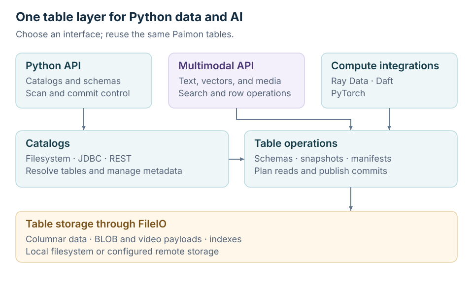

<!--
Licensed to the Apache Software Foundation (ASF) under one
or more contributor license agreements.  See the NOTICE file
distributed with this work for additional information
regarding copyright ownership.  The ASF licenses this file
to you under the Apache License, Version 2.0 (the
"License"); you may not use this file except in compliance
with the License.  You may obtain a copy of the License at

  http://www.apache.org/licenses/LICENSE-2.0

Unless required by applicable law or agreed to in writing,
software distributed under the License is distributed on an
"AS IS" BASIS, WITHOUT WARRANTIES OR CONDITIONS OF ANY
KIND, either express or implied.  See the License for the
specific language governing permissions and limitations
under the License.
-->

# PyPaimon

PyPaimon is the Python implementation of Apache Paimon. It connects to catalogs,
reads and writes lakehouse tables, and makes text, vectors, images, and video
available to Python data and training workflows. The core Python API does not
require a JDK.

Start with [Installation](./installation), then run the [Quick Start](./quick-start)
to create a local table, commit a batch, and read it back.

## Choose an API

| You want to… | Start here | What you control |
| --- | --- | --- |
| Work with ordinary Paimon tables | [Python API](./python-api) | Catalogs, schemas, predicates, scan splits, and explicit commits |
| Build a text, vector, or media application | [Multimodal API](./multimodal-api) | Table operations, payload reads, search, and row IDs through a compact interface |
| Process data across workers | [Ray Data](./ray-data) or [Daft](./daft) | Distributed reads, transforms, and writes |
| Feed a training loop | [PyTorch](./pytorch) | Iterable reads, frame decoding, and contiguous windows |
| Query or inspect a table interactively | [SQL](./sql) or [CLI](./cli) | SQL results, table metadata, tags, and branches |

The multimodal API wraps the same catalog and table implementation. It creates
data-evolution tables without primary keys and supplies defaults for row tracking,
deletion vectors, and BLOB descriptors. Use the Python API when you need to work
with other table types or control scan and commit steps directly.

## Learn by task

| Task | Guides |
| --- | --- |
| Connect and define data | [Catalogs and tables](./catalogs), [data types](./data-types) |
| Read and write batches | [Batch writes](./writing), [batch reads](./reading) |
| Follow new data | [Streaming reads and consumers](./streaming) |
| Retain a dataset version | [Tags](./manage-tags), [branches and rollback](./branches) |
| Store and update media | [BLOB storage](./blob), [BLOB object API](./blob-store), [data evolution](./data-evolution), [video frames](./video) |
| Match new data to existing rows | [Upsert and merge](./merge-into), [Ray joins](./ray-joins) |
| Backfill derived features | [Ray row IDs and backfills](./ray-row-ids) |
| Retrieve candidates | [Vector and full-text search](./multimodal-search), [row IDs](./multimodal-reading#row-ids) |
| Import robot data | [HDF5 and ROSBag](./dataset-ingestion), [LeRobot](./lerobot), [RoboMIND AgileX](./robomind-agilex) |
| Compare training storage | [RoboMIND ACT benchmark](./robomind-act-benchmark) |
| Configure storage access | [FUSE](./fuse-support), [PyJindoSDK](./pyjindosdk-support) |
| Inspect metadata | [System tables](./system-tables), [CLI query and inspect](./cli-query) |

## Environment Settings

See [Installation](./installation) for virtual environments and package installation.

## Build From Source

See [Install from source](./installation#install-from-source) to use this checkout.

## Optional Dependencies

See [Optional dependencies](./installation#optional-dependencies) for file formats,
compute frameworks, dataset importers, and their Python version requirements.
