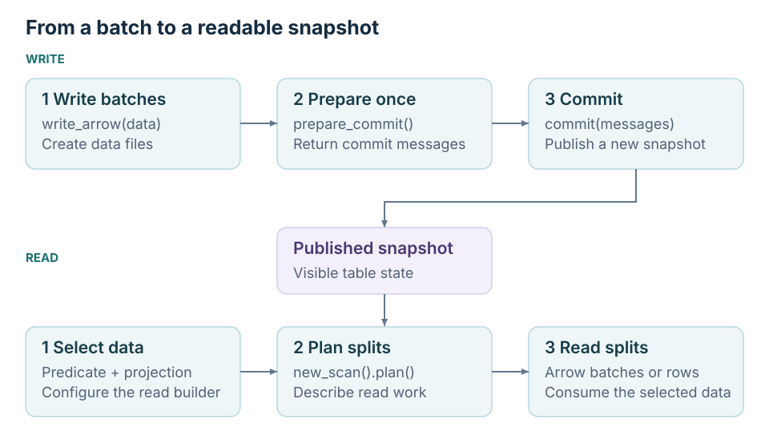

<!--
Licensed to the Apache Software Foundation (ASF) under one
or more contributor license agreements.  See the NOTICE file
distributed with this work for additional information
regarding copyright ownership.  The ASF licenses this file
to you under the Apache License, Version 2.0 (the
"License"); you may not use this file except in compliance
with the License.  You may obtain a copy of the License at

  http://www.apache.org/licenses/LICENSE-2.0

Unless required by applicable law or agreed to in writing,
software distributed under the License is distributed on an
"AS IS" BASIS, WITHOUT WARRANTIES OR CONDITIONS OF ANY
KIND, either express or implied.  See the License for the
specific language governing permissions and limitations
under the License.
-->

# Quick Start

Create a table, write a batch, and read selected rows using only local storage.
Complete [Installation](./installation) first. Run the Python blocks below in
order in the same interpreter or script; no catalog server is needed.

## Create a catalog and table

Use a new temporary warehouse so repeated runs do not share table state.
The warehouse path is printed so you can inspect the files afterward.

```python
from pathlib import Path
from tempfile import mkdtemp

import pyarrow as pa
from pypaimon import CatalogFactory, Schema

warehouse = Path(mkdtemp(prefix="pypaimon-quickstart-"))
print("Warehouse:", warehouse)
catalog = CatalogFactory.create({"warehouse": warehouse.as_uri()})
catalog.create_database("demo", ignore_if_exists=True)

arrow_schema = pa.schema([
    ("id", pa.int64()),
    ("name", pa.string()),
    ("score", pa.int32()),
])
schema = Schema.from_pyarrow_schema(arrow_schema, options={"bucket": "-1"})
catalog.create_table("demo.scores", schema, ignore_if_exists=False)
table = catalog.get_table("demo.scores")
```

This is an append table without primary keys. The catalog stores table metadata
and data beneath the warehouse. See [Catalogs and Tables](./catalogs) for REST,
JDBC, remote storage, partitioning, and schema changes.

## Write and commit a batch

Writing produces data files. Committing publishes a snapshot that makes those
files visible to readers. Always close the writer and commit object when done.

```python
data = pa.Table.from_pydict({
    "id": [1, 2, 3],
    "name": ["Alice", "Bob", "Charlie"],
    "score": [92, 75, 88],
}, schema=arrow_schema)

builder = table.new_batch_write_builder()
writer = builder.new_write()
commit = builder.new_commit()
try:
    writer.write_arrow(data)
    commit.commit(writer.prepare_commit())
finally:
    writer.close()
    commit.close()
```



A batch writer can accept multiple input batches before `prepare_commit()`.
Create a new writer for the next commit. See [Batch Writes](./writing) for
overwrite behavior and commit callbacks.

## Filter and read

Build a predicate and projection before planning the scan. The plan returns
splits describing the work for the reader.

```python
read_builder = table.new_read_builder()
predicate = read_builder.new_predicate_builder().greater_or_equal("score", 85)
read_builder = read_builder.with_filter(predicate).with_projection(["id", "name"])
splits = read_builder.new_scan().plan().splits()
reader = read_builder.new_read()
result = reader.to_arrow(splits).sort_by([("id", "ascending")])
print(result.to_pylist())
```

Expected output:

```text
[{'id': 1, 'name': 'Alice'}, {'id': 3, 'name': 'Charlie'}]
```

The example sorts the result for display; ordinary scans do not promise a row
order. For larger results, use the [Arrow batch reader](./reading#read-apache-arrow)
instead of collecting the full result in memory.

## Try the multimodal interface

Use the same warehouse through `pypaimon.multimodal` to create a data-evolution
table. The high-level `add` method handles writing and committing for you.

```python
import pypaimon.multimodal as pm

conn = pm.connect(database="demo", options={"warehouse": warehouse.as_uri()})
documents = conn.create_table("documents", schema=pa.schema([
    ("id", pa.int64()),
    ("content", pa.string()),
    ("embedding", pa.list_(pa.float32(), 3)),
]))
documents.add([
    {"id": 1, "content": "Paimon table", "embedding": [0.1, 0.2, 0.3]},
    {"id": 2, "content": "Training data", "embedding": [0.4, 0.5, 0.6]},
])
rows = documents.scan().select(["id", "content"]).to_list()
print(sorted(rows, key=lambda row: row["id"]))
```

Expected output:

```text
[{'id': 1, 'content': 'Paimon table'}, {'id': 2, 'content': 'Training data'}]
```

Continue with [Multimodal Tables](./multimodal-tables),
[BLOB Storage](./blob), or [Vector and Full-text Search](./multimodal-search).
For distributed processing, choose [Ray Data](./ray-data) or [Daft](./daft).
