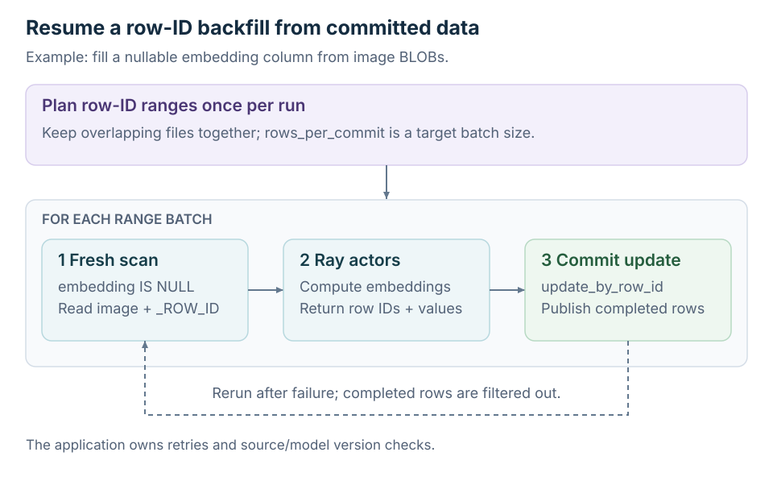

<!--
Licensed to the Apache Software Foundation (ASF) under one
or more contributor license agreements.  See the NOTICE file
distributed with this work for additional information
regarding copyright ownership.  The ASF licenses this file
to you under the Apache License, Version 2.0 (the
"License"); you may not use this file except in compliance
with the License.  You may obtain a copy of the License at

  http://www.apache.org/licenses/LICENSE-2.0

Unless required by applicable law or agreed to in writing,
software distributed under the License is distributed on an
"AS IS" BASIS, WITHOUT WARRANTIES OR CONDITIONS OF ANY
KIND, either express or implied.  See the License for the
specific language governing permissions and limitations
under the License.
-->

# Ray Row IDs and Backfills

Read selected rows and write derived columns using target-table row IDs. These APIs require Ray 2.50 or newer and data-evolution tables with row tracking. The read/update paths on this page reject deletion-vectors-enabled tables; see [Multimodal Reads](./multimodal-reading) for high-level BLOB processing.

Install a Ray version that supports these APIs in both the driver and workers:

```shell
python -m pip install 'pypaimon[ray]' 'ray>=2.50,<3'
```

| Starting point | Use |
| --- | --- |
| Target row IDs and replacement values | [Update by row ID](#update-by-row-id) |
| Target row IDs and columns to fetch | [Read by row ID](#read-by-row-id) |
| A full-table backfill to commit in batches | [Process row-ID ranges](#process-row-id-ranges) |

The examples below use existing tables. `ray_dataset` must carry target row IDs
and replacement columns; `locator_ds` must carry the target row IDs in the named
column. See [Ray joins](./ray-joins) for matching business keys to a locator table.

## Update By Row Id

`update_by_row_id` updates columns of a **data-evolution** table straight from a
source that already carries `_ROW_ID` and the new values. Each row is routed to the
data file that owns its row id and only those files are rewritten — the target is
**never fully read** and there is **no join against it** (unlike
`merge_into(on=["_ROW_ID"])`, which reads and shuffle-joins the whole target). It
pairs with `bucket_join`, which produces the row ids without a shuffle. Requires
`ray >= 2.50` and a target with `data-evolution.enabled` and `row-tracking.enabled`.

```python
from pypaimon.ray import update_by_row_id

metrics = update_by_row_id(
    target="database_name.table_name",
    source=ray_dataset,          # ray.data.Dataset / pa.Table / pandas, carrying _ROW_ID
    catalog_options={"warehouse": "/path/to/warehouse"},
    update_cols=["feature"],     # non-blob columns to overwrite
)
print(metrics)   # {"num_updated": 50}
```

**Parameters:**
- `source`: a `ray.data.Dataset`, `pyarrow.Table`, or `pandas.DataFrame` carrying the
  target `_ROW_ID` and every column in `update_cols`; extra columns are ignored, and
  values are cast to the target column types. A table-name source is not accepted: a
  table's system `_ROW_ID` is its own and cannot address the target's rows.
- `update_cols`: the non-blob columns to overwrite. Must be non-empty.
- `num_partitions`: parallelism for grouping the update rows by target file.
  The default uses reliable source metadata when available; otherwise it uses
  Ray's hash-shuffle default. Target file count and cluster CPUs bound the result.
- `ray_remote_args`: Ray remote options applied to the update tasks.

**Returns:** `{"num_updated": <rows>}`.

**Notes:**
- The row IDs must come from the target table and exist in its current snapshot.
  IDs outside the target's valid ranges raise an error. Range validation cannot
  detect an ID copied from another table that happens to have the same numeric
  value, or determine whether a derived value was computed from outdated data.
  Keep the source table and snapshot with persisted row-ID work lists, and define
  how your application handles concurrent changes before writing results back.
- Multiple source rows mapping to the same `_ROW_ID` is rejected — deduplicate first.
- Blob columns cannot be updated through this path.
- Partition columns cannot be updated (in-place rewrite can't move a row across partitions).
- Deletion-vectors-enabled tables are not supported yet: a DV-deleted row still lives
  in its data file, so it can't be told apart from a live row without reading the target.

## Read By Row Id

`read_by_row_id` is the read-side mirror of `update_by_row_id`: it reads columns
(including blob) of a **data-evolution** table for a set of `_ROW_ID`s, without
scanning or joining the whole target. Each row id is routed to the data file that
owns it and only those files — and only the matched rows — are read. It pairs with
`bucket_join` (which produces the row ids) and feeds `update_by_row_id`: match by
key → read the matched rows → transform → write back by row id. Requires
`ray >= 2.50` and a target with `data-evolution.enabled` and `row-tracking.enabled`.

```python
from pypaimon.ray import read_by_row_id

ds = read_by_row_id(
    target="database_name.table_name",
    row_ids=locator_ds,          # ray.data.Dataset / pa.Table / pandas, carrying the row ids
    catalog_options={"warehouse": "/path/to/warehouse"},
    projection=["image", "feature"],   # columns to read; may include blob columns
    row_id_col="row_id",         # source column holding the row ids (default "_ROW_ID")
)
# ds: ray.data.Dataset of (image, feature, _ROW_ID) for the matched rows
```

**Parameters:**
- `row_ids`: a `ray.data.Dataset`, `pyarrow.Table`, or `pandas.DataFrame` carrying the
  target row ids in column `row_id_col`; other columns are ignored. A table-name source
  is not accepted (a table's system `_ROW_ID` is its own and cannot address the target).
- `projection`: top-level columns to read (nested paths are not supported). Blob columns
  are resolved to their payloads, unless overridden via `dynamic_options`. Must be non-empty.
- `row_id_col`: the source column holding the row ids (default `_ROW_ID`); set e.g.
  `row_id_col="row_id"` to consume a `bucket_join` locator directly.
- `dynamic_options`: read options applied via `table.copy`, e.g.
  `{"blob-as-descriptor": "true"}` to read blob columns as small `BlobDescriptor` bytes
  (resolved later with `map_with_blobs`), or `scan.snapshot-id` / `scan.tag-name` to read a
  specific snapshot. Options that flip table invariants (`data-evolution.enabled`,
  `row-tracking.enabled`, `deletion-vectors.enabled`) are rejected.
- `num_partitions`: parallelism for grouping the row ids by target file. The
  default uses reliable source metadata when available; otherwise it uses Ray's
  hash-shuffle default. Target file count and cluster CPUs bound the result.
- `ray_remote_args`: Ray remote options applied to the read tasks.

**Returns:** a `ray.data.Dataset` of `(*projection, _ROW_ID)`.

**Notes:**
- Lookup/set semantics, like SQL `... WHERE _ROW_ID IN (...)`: one row per **distinct**
  matched row id (duplicates deduplicated), input order not preserved (rows come out
  grouped by owning file). An empty source yields an empty but correctly-typed Dataset.
- The row IDs must come from the target table and exist in the resolved snapshot
  (latest, or the one selected via `dynamic_options`). IDs outside its valid
  ranges raise an error; matching numeric IDs from another table cannot be
  distinguished. Persist the source table and snapshot or tag with row-ID work
  lists, and select that version when reading them.
- Deletion-vectors-enabled tables are not supported yet, for the same reason as
  `update_by_row_id`.
- For a non-empty target, the `row_ids` source is consumed lazily by the downstream
  action, not read here. A lazy source missing `row_id_col` raises when the read runs
  (a materialized source raises up front).

## Process Row Id Ranges

`process_row_id_ranges` plans the latest snapshot into logical file groups and
calls a user-supplied processor synchronously for each target-sized batch. The
processor receives a `List[Range]` and owns the read, distributed computation,
commit, and retry policy. Base files and overlapping data-evolution, BLOB, or
VECTOR files remain in one indivisible group.

`rows_per_commit` is therefore a target rather than a hard limit: the function
never splits a file group, so a batch can contain more rows. The range plan is
captured once at the start of a run, callbacks execute in row-id order, and an
exception stops later callbacks.

### Resumable embedding backfill from a BLOB column



The following pattern reads an `image` BLOB, computes a nullable `embedding`
VECTOR with Ray, and commits about one million row ids at a time. It pushes
`embedding IS NULL` into each range scan, so a completed row is filtered before
its image payload is materialized. Rerun the whole function after a failure;
already committed ranges are skipped automatically.

```python
import pyarrow as pa

from my_embedding_model import load_model
from pypaimon import CatalogFactory
from pypaimon.ray import process_row_id_ranges, update_by_row_id

TARGET = "database_name.images"
CATALOG_OPTIONS = {"warehouse": "/path/to/warehouse"}
EMBEDDING_DIM = 768


class EmbedImages:
    def __init__(self):
        # Constructed once in every Ray actor, not once per Arrow batch.
        self.model = load_model()

    def __call__(self, batch: pa.Table) -> pa.Table:
        vectors = self.model.encode(batch["image"].to_pylist())
        return pa.table({
            "_ROW_ID": batch["_ROW_ID"],
            "embedding": pa.array(
                vectors.tolist(),
                type=pa.list_(pa.float32(), EMBEDDING_DIM),
            ),
        })


def process_ranges(ranges):
    # Resolve a fresh table for every batch so this scan sees embeddings
    # committed by earlier callbacks. Force BLOB payloads rather than descriptors.
    table = (
        CatalogFactory.create(CATALOG_OPTIONS)
        .get_table(TARGET)
        .copy({"blob-as-descriptor": "false"})
    )
    read_builder = table.new_read_builder().with_projection(
        ["image", "embedding", "_ROW_ID"]
    )
    read_builder.with_filter(
        read_builder.new_predicate_builder().is_null("embedding")
    )
    splits = (
        read_builder.new_scan()
        .with_row_ranges(ranges)
        .plan()
        .splits()
    )
    pending = read_builder.new_read().to_ray(
        splits,
        concurrency=64,
        ray_remote_args={"num_cpus": 1},
    )
    if pending.limit(1).count() == 0:
        return

    updates = pending.map_batches(
        EmbedImages,
        batch_format="pyarrow",
        batch_size=128,
        concurrency=8,       # required for a callable-class Ray actor pool
        num_gpus=1,
    )

    # update_by_row_id executes the Ray pipeline and makes one Paimon commit.
    # It is valid for VECTOR/ARRAY embedding columns; BLOB columns themselves
    # cannot be updated through update_by_row_id.
    update_by_row_id(
        target=TARGET,
        source=updates,
        catalog_options=CATALOG_OPTIONS,
        update_cols=["embedding"],
        num_partitions=128,
    )


process_row_id_ranges(
    TARGET,
    CATALOG_OPTIONS,
    rows_per_commit=1_000_000,
    processor=process_ranges,
)
```

The target must enable `row-tracking.enabled` and
`data-evolution.enabled`; `embedding` must be nullable and the table must not
enable deletion vectors. If the source BLOB or embedding model can change,
use an additional source/model-version column instead of treating every
non-null embedding as permanently complete. `process_row_id_ranges` does not
retry a failed processor itself—the resumability in this example comes from
rerunning it and selecting only rows whose embedding is still null.
