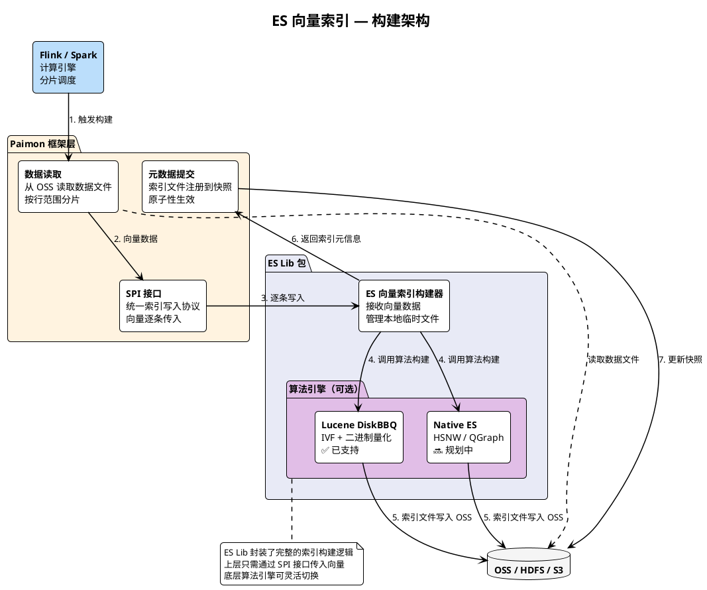
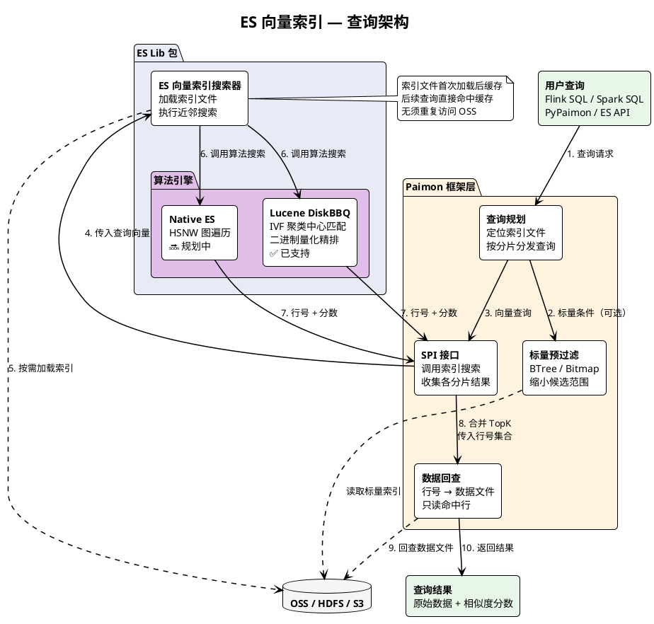
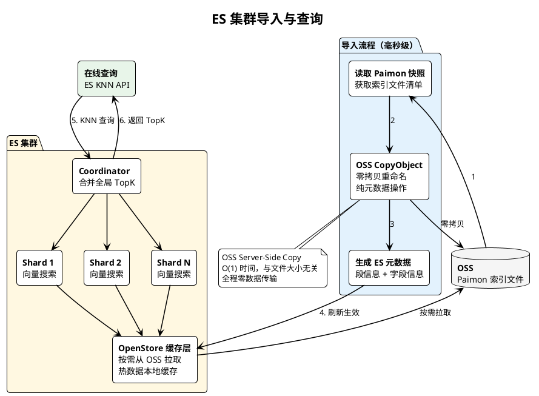
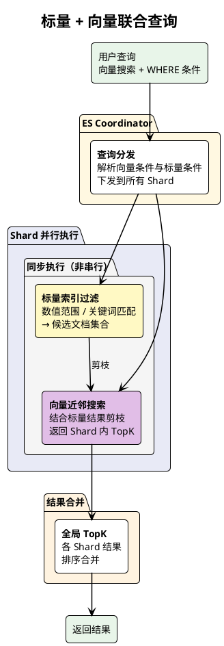
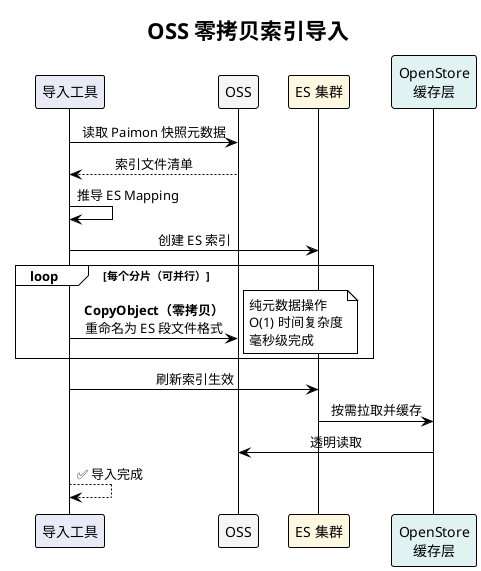
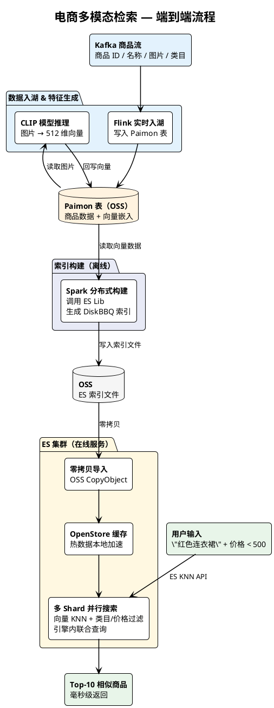
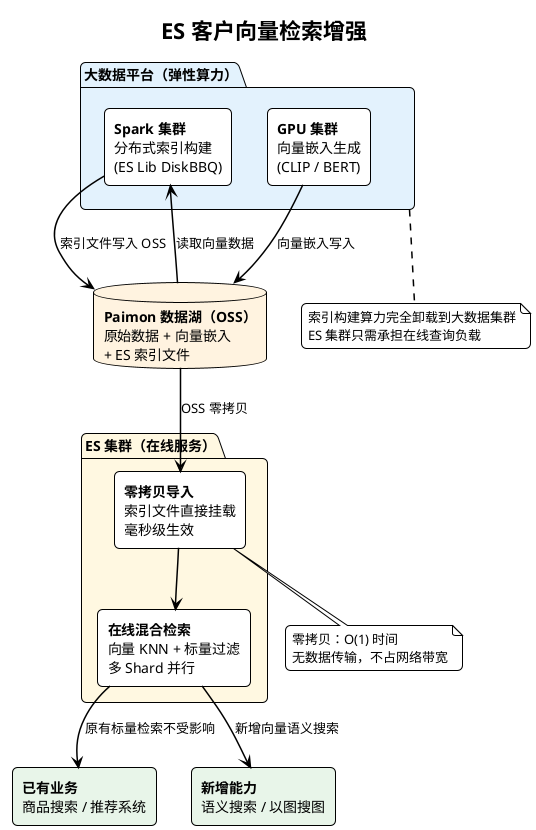

# Elasticsearch 向量索引引擎（Paimon 数据湖集成）

Elasticsearch 向量索引引擎是阿里云 Elasticsearch 团队基于 Apache Paimon 数据湖的 Global Index 框架，自研的数据湖向量检索解决方案。支持在 Paimon 数据湖中直接构建 ES 向量索引，并通过 ES 集群实现分布式高性能向量检索，真正做到 **一份数据、多引擎检索、零数据搬迁**。本文主要介绍该方案的适用场景、整体架构、核心优势以及能力演进路线。

## 背景信息

在 AI + 数据湖场景下，企业通常需要将多模态数据（文本、图片、音视频）统一入湖，通过 AI 模型生成向量嵌入，然后支持语义检索、以图搜图、RAG 知识库等应用。Apache Paimon 是一种数据湖存储格式，通过 Global Index 框架和可插拔的索引引擎，支持向量索引、BTree 标量索引、Bitmap 索引、全文索引等多种索引类型，使用户能够在湖上使用不同的查询条件高效检索数据。

然而，Paimon 作为存储框架，在查询体验上存在局限。客户的向量查询需要通过 Spark / Flink 提交批处理作业，从作业调度、资源申请到执行完成，等待时间通常在秒级甚至分钟级，无法满足在线服务的延迟要求；查询结束后计算资源即释放，索引数据无法常驻内存，每次查询都需要重新加载索引文件，冷启动开销大。此外，Paimon 内置的标量索引和向量索引只能两阶段串行执行（先标量过滤，再向量搜索），无法在搜索过程中利用标量条件实时剪枝优化。另一方面，Elasticsearch 本身拥有强大的分布式检索能力，但在大规模向量索引构建场景下面临瓶颈——向量索引构建是 CPU 密集型任务，在线上 ES 集群中执行会**抢占在线查询资源**，影响已有搜索业务的稳定性；ES 集群的计算资源是固定的，面对数亿级向量的批量构建需求，无法像大数据集群那样弹性扩展。

Elasticsearch 向量索引引擎基于 Paimon 的 **SPI 可插拔机制**，将 ES 的各类型索引直接嵌入数据湖框架。该方案让 Paimon 负责统一存储和分布式构建调度，ES 负责在线分布式检索和联合查询，两者优势互补——用户无须搬迁数据，即可获得 ES 级别的分布式向量检索和标量联合查询能力。

## 适用场景

Elasticsearch 向量索引引擎适用于以下场景：

- **多模态数据检索**：电商以图搜图、以文搜图，商品数据在 Paimon 中统一存储，通过 CLIP 等模型生成向量后，使用 ES 引擎进行语义检索。
- **企业 RAG 知识库**：企业文档分块后生成向量嵌入，结合标量过滤（按来源、时间等条件筛选）和向量语义搜索，为 LLM 提供精准上下文。
- **大规模特征工程**：使用 Ray / Flink / Spark 对海量数据进行分布式 AI 推理，向量结果写回 Paimon 后自动构建 ES 索引，支持实时查询。
- **湖仓一体向量检索**：已有 Paimon 数据湖的客户，无须搬迁数据即可通过 ES 集群获得分布式向量检索能力。

## Paimon 向量索引基础架构

在介绍 ES 方案之前，先了解 Paimon 数据湖的向量索引基本架构。

Paimon 采用 **数据文件与索引文件分离** 的存储设计。数据文件存储原始业务数据，索引文件按行号范围分片独立存储。索引查询返回一组行号集合，框架层再根据行号映射到数据文件读取原始数据。

Paimon 原有的向量查询分为 **两个独立阶段**：
1. **索引搜索阶段**：在索引文件中执行向量近邻搜索，得到一组匹配的行号和相似度分数。如果有标量过滤条件，则先通过 BTree / Bitmap 标量索引缩小候选范围，再在候选集上做向量搜索。
2. **数据回查阶段**：根据行号映射到具体的数据文件，只读取命中的行，附上相似度分数返回给用户。

目前 Paimon 内置的向量索引引擎是 **Lumina DiskANN**，标量索引则有 **BTree** 和 **Bitmap** 两种。所有索引引擎通过 SPI 插件机制接入，框架负责索引的分片调度、构建编排和查询路由。

## ES 向量索引方案架构

### 索引构建架构

ES 向量索引通过 Paimon 的 SPI 插件机制接入构建链路。Flink 或 Spark 作为计算引擎负责调度和分片，Paimon 框架从 OSS 读取数据文件并提供统一的写入接口，ES Lib 包接收向量数据后调用底层算法引擎（Lucene DiskBBQ / Native ES）构建索引，最终将索引文件写回 OSS。

构建流程要点：
- **Flink / Spark** 负责分布式调度，将全表数据按行范围自动分片，每个分片独立并行构建。
- **Paimon 框架** 负责从 OSS 读取数据文件，通过统一的 SPI 接口将向量数据逐条传入 ES Lib。
- **ES Lib 包** 是 ES 团队提供的 Java 库，封装了索引构建的完整逻辑。它在本地临时目录中调用底层算法引擎构建索引，构建完成后将索引文件写入 OSS。
- **算法引擎** 当前支持 Lucene DiskBBQ（IVF + 二进制量化），后续将支持 Native ES（HNSW / QGraph）。
- 构建完成后，Paimon 将索引文件信息注册到快照中，**原子性生效**。

### 索引查询架构

查询时，Paimon 框架从快照中定位索引文件，通过 SPI 接口调用 ES Lib 的搜索能力。ES Lib 内部按需从 OSS 加载索引数据，调用算法引擎执行向量近邻搜索，返回行号和分数。框架再根据行号回查数据文件，返回最终结果。

查询流程要点：
- **Paimon 框架** 负责查询规划（定位索引分片）、标量预过滤（可选）、结果合并和数据回查。
- **ES Lib 包** 封装了索引文件的加载和搜索逻辑。首次查询时按需从 OSS 加载索引数据并缓存，后续查询直接命中缓存。
- **算法引擎** 执行实际的向量近邻搜索：DiskBBQ 通过 IVF 聚类中心匹配 + 二进制量化精排；Native ES 通过 HNSW 图遍历搜索。
- 查询结果为行号集合 + 相似度分数，框架根据行号映射到数据文件，**只读取命中的行**，避免全表扫描。

### ES 集群导入与查询

除了通过 Paimon 框架查询外，ES 索引文件还可以**零拷贝导入** ES 集群，利用 ES 的分布式查询能力提供在线服务。

导入要点：
- 利用 OSS Server-Side CopyObject 将 Paimon 索引文件重命名为 ES 段格式，纯元数据操作，**毫秒级完成**。
- ES 通过 OpenStore（Alluxio）透明读取 OSS 上的索引文件，热数据自动缓存到本地。
- 多 Shard **并行搜索**，Coordinator 合并全局 TopK 返回。

## 功能优势

### 分布式并行构建

通过 Flink 或 Spark 的分布式算力进行索引构建。框架自动将全表数据按行范围分片，每个分片独立并行构建 ES 向量索引，充分利用大数据集群资源，适合千万级甚至亿级向量的批量构建。

### 标量 + 向量联合检索

ES 引擎支持在每个 Shard 内 **同步执行** 标量过滤和向量检索。向量搜索过程中可实时利用标量过滤结果进行 **剪枝优化**，跳过不符合条件的候选区域。相比先标量过滤、再向量搜索的串行两阶段方案，在高选择性过滤场景下性能提升显著。

### ES 多 Shard 分布式并行查询

Paimon 原有的向量查询方式是通过 Spark 作业、Flink 作业或用户脚本直接读取 OSS 上的索引文件进行搜索。这种方式存在明显的弊端：

- **查询延迟高**：每次查询都需要 **提交一个批处理作业**（Spark Job / Flink Job），从作业调度、资源申请到实际执行，整个链路的等待时间通常在 **秒级甚至分钟级**，无法满足在线服务的延迟要求。
- **无常驻服务**：查询结束后计算资源释放，索引数据无法常驻内存，下次查询需要重新加载索引文件，**冷启动开销大**。
- **单机瓶颈**：用户脚本（PyPaimon）查询时只能在单节点上顺序扫描各分片，数据量增长后查询时间线性增长。

将索引导入 ES 集群后，查询体验有本质性的提升：

- **毫秒级响应**：ES 集群提供常驻的查询服务，索引数据通过 OpenStore 缓存在本地，查询时无须调度作业，直接执行搜索，端到端延迟可控制在 **毫秒级**。
- **多 Shard 并行**：ES 天然支持将索引数据分散到多个 Shard 上，每个 Shard 独立并行执行向量搜索，Coordinator 节点合并全局 TopK 返回。集群算力线性扩展，查询延迟不随数据规模增长。
- **OpenStore 智能缓存**：ES 通过 OpenStore（Alluxio）透明读取 OSS 上的索引文件，自动将热数据缓存到本地。首次查询按需拉取，后续查询直接命中本地缓存，兼顾 **低成本存储** 和 **高性能查询**。
- **标准 API 接入**：查询通过标准的 ES KNN API 发起，应用端无须依赖大数据引擎，可直接嵌入在线服务、微服务或网关中。

| 维度 | Paimon 原有方式（Spark / Flink / 脚本） | ES 集群查询 |
|------|--------------------------------------|------------|
| **查询延迟** | 秒级~分钟级（作业调度 + 资源申请） | 毫秒级（常驻服务，直接执行） |
| **并发能力** | 单作业单查询，并发受限 | 多客户端并发，ES 集群弹性承载 |
| **扩展性** | 单节点或有限并行度 | 多 Shard 水平扩展，算力线性增长 |
| **索引缓存** | 每次查询重新加载，冷启动开销大 | OpenStore 本地缓存，热查询零加载 |
| **接入方式** | 需依赖 Spark / Flink / Python 环境 | 标准 ES API，任意语言可调用 |

### OSS 零拷贝索引导入

Paimon 构建的 ES 索引文件存储在 OSS 上，导入 ES 集群时利用 **OSS Server-Side CopyObject**（纯元数据操作），毫秒级完成，全程零数据传输，不受索引文件大小影响。

### 数据一致性保障

基于 Paimon 的 Snapshot 机制，索引文件和数据文件的提交是原子性的——要么全部可见，要么全部不可见。跨引擎查询时，数据始终保持一致，无脏读或幻读问题。

### 统一数据湖存储

结构化数据、向量嵌入、图片 / 文档等多模态数据统一存储在 Paimon 表中，一份数据支持多种索引（ES 向量、Lumina DiskANN、BTree 标量、Bitmap 等），无须为不同检索需求维护独立的数据副本。

## Paimon + ES 联合方案能力增强

Paimon 和 ES 各自在不同维度上为联合方案带来了核心能力增强。两者结合形成互补——Paimon 解决数据存储、一致性和构建调度问题，ES 解决在线查询、联合检索和分布式并行问题。

### ES 带来的能力增强

| 能力维度 | 增强前（仅 Paimon） | 增强后（接入 ES） |
|---------|-------------------|---------------------|
| **向量检索** | Lumina DiskANN 单机检索 | **ES 多 Shard 并行向量检索，毫秒级在线响应** |
| **标量检索** | BTree / Bitmap 基础标量过滤 | **ES Lucene 标量索引（数值范围 / 关键词倒排），检索能力更丰富** |
| **联合条件过滤** | 两阶段串行：先标量过滤，再向量搜索 | **ES 引擎内向量与标量同步执行，搜索过程中实时剪枝** |
| **在线查询** | 需提交 Spark / Flink 批作业，秒级~分钟级延迟 | **ES 集群常驻服务，标准 KNN API 接入，毫秒级响应** |
| **分布式查询** | 依赖 Flink / Spark 作业调度，并行度受限 | **ES 原生多 Shard 水平扩展，算力线性增长** |
| **索引缓存** | 每次查询重新加载索引文件，冷启动开销大 | **OpenStore 本地智能缓存，热查询零加载延迟** |
| **多算法引擎** | 仅 Lumina DiskANN | **DiskBBQ（IVF + 量化）、Native ES（HNSW / QGraph）多引擎可选** |

> 💡 **ES 不仅是向量检索引擎**：ES 同时支持 Lucene 标量索引（数值范围查询、关键词倒排索引）和向量索引（DiskBBQ / Native HNSW），并能在引擎内部将两者 **同步联合执行**。用户可以在一次查询中同时指定"类目 = 服饰 AND 价格 < 500"等标量条件和向量语义搜索，ES 在搜索过程中实时利用标量过滤结果进行剪枝，而非传统的两阶段串行方案。

### Paimon 带来的能力增强

| 能力维度 | 增强前（仅 ES） | 增强后（接入 Paimon） |
|---------|---------------|------------------------|
| **数据存储** | 数据需导入 ES 集群，独立管理 | **统一存储在 Paimon 数据湖，一份数据多引擎共享，零搬迁** |
| **存储成本** | ES 集群全量存储，成本高 | **OSS 按量付费 + ES 按需缓存，存储成本大幅降低** |
| **索引构建** | ES 集群自行构建，受集群资源限制 | **Flink / Spark 分布式并行构建，弹性扩展，适合亿级向量** |
| **索引导入** | 传统导入需全量数据传输 | **OSS 零拷贝导入，毫秒级完成，全程无数据传输** |
| **数据一致性** | 双写场景下一致性难以保证 | **Paimon Snapshot 原子提交，索引与数据天然一致** |
| **多模态统一** | ES 仅存储向量和标量字段 | **Paimon 表统一存储结构化、向量、图片 / 文档等多模态数据** |
| **AI 特征工程** | 需额外系统完成特征计算 | **PyPaimon 原地计算，支持 Ray 分布式推理，向量结果直接入湖** |
| **多引擎协同** | ES 单一引擎 | **SPI 插件机制，ES / Lumina / BTree / Bitmap 等多索引引擎并存** |

## 客户使用案例

### 电商多模态检索

电商平台需要支持"以图搜图"和"以文搜图"功能。商品数据（ID、名称、描述、图片）通过 Flink 实时入湖至 Paimon 表，使用 CLIP 模型生成向量嵌入。通过 Spark 分布式构建 ES 向量索引，索引文件零拷贝导入 ES 集群。用户输入文本或图片后，通过 ES KNN API 进行语义检索，同时结合商品类目、价格等标量条件联合过滤，毫秒级返回最相似的商品列表。

### ES 已有客户向量检索增强

某 ES 存量客户已使用 ES 集群承载在线搜索业务，数据量约 5000 万条商品文档。客户希望在现有基础上增加向量语义搜索能力，但面临两个问题：1）ES 集群资源紧张，无法承担大规模向量索引构建的算力消耗；2）向量嵌入的生成依赖 GPU 集群，数据需要在大数据平台和 ES 之间来回搬迁。

通过 Paimon + ES 联合方案，客户将原始数据和向量嵌入统一存储在 Paimon 数据湖中，利用 Spark 集群的弹性算力完成分布式向量索引构建（ES Lib DiskBBQ），构建完成后通过 OSS 零拷贝将索引文件导入 ES 集群，全程无数据传输。ES 集群只需承担在线查询负载，索引构建的算力完全卸载到大数据集群。

该场景的核心价值：
- **算力卸载**：向量索引构建的 CPU 密集型任务由 Spark 集群承担，ES 集群资源不受影响，在线搜索业务零干扰。
- **零数据搬迁**：原始数据、向量嵌入、索引文件全部存储在 OSS 上，ES 集群通过零拷贝导入 + OpenStore 直读，全程无数据传输。
- **渐进式增强**：ES 集群原有的标量搜索业务不受影响，新增的向量语义搜索能力通过挂载新索引即可上线，业务平滑升级。

## 相关信息

- Apache Paimon 官方文档：[https://paimon.apache.org](https://paimon.apache.org)
- 阿里云 DLF 数据湖：[数据湖构建-服务接入点](https://help.aliyun.com/zh/dlf/dlf-2-0/getting-started/service-access-point)
- Elasticsearch OpenStore 存储引擎：[OpenStore 智能混合存储引擎](https://help.aliyun.com/zh/es/product-overview/openstore-intelligent-hybrid-storage-engine)
